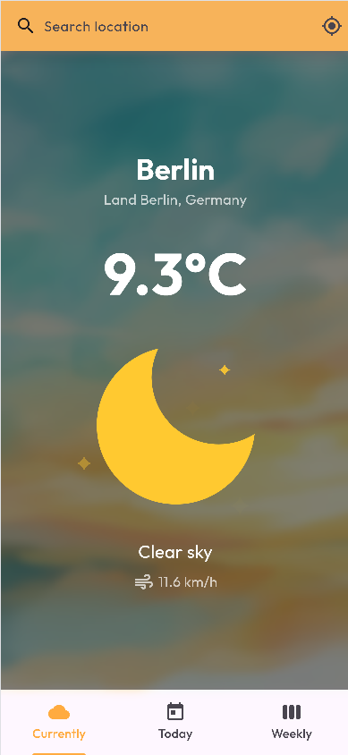
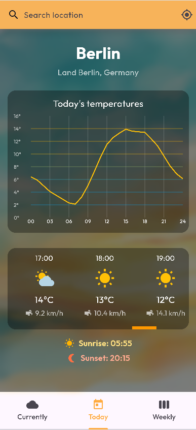
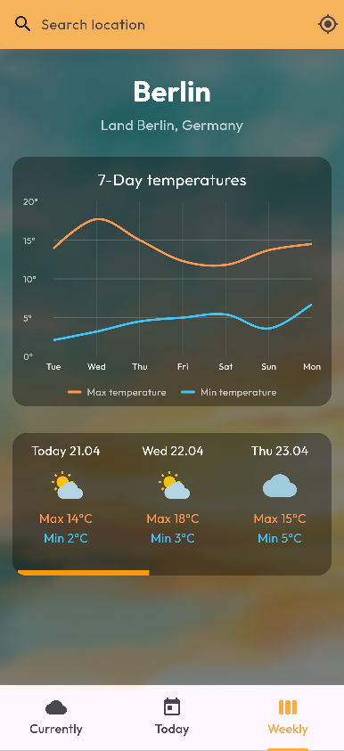

# 1. Project Title

## Weather App

A cross-platform Flutter weather application that provides current conditions, hourly trends, and a 7-day forecast using live geolocation and city search.

## 2. Overview

This project was built to practice end-to-end mobile application development with real-world API integration and clean UI architecture.

It solves a common UX problem: quickly checking reliable weather data for either your current location or any searched city, in a single lightweight app.

Why I built it:

- To strengthen Flutter fundamentals across UI, networking, and asynchronous state updates
- To implement a modular architecture with clear separation between data services, models, and presentation
- To ship a polished, multi-platform project suitable for a professional portfolio

## 3. Demo / Screenshots

### App Demo (Screen Recording)


### Screenshots

<table>
	<tr>
		<td></td>
		<td></td>
		<td></td>
	</tr>
</table>

## 4. Tech Stack

- Language: Dart
- Framework: Flutter
- Networking: `http`
- Location: `geolocator`
- Geocoding: `geocoding` + Open-Meteo Geocoding API + BigDataCloud reverse geocoding API
- Data Visualization: `fl_chart`
- Animated Weather States: `lottie`
- Linting / Code Quality: `flutter_lints`
- Platforms: Android, iOS, Web, Windows, macOS, Linux

## 5. Architecture / Implementation

The app follows a modular, separation-of-concerns architecture:

- Presentation Layer (`lib/`)
  - `homepage.dart`: Main container with search bar, tab navigation, and async data orchestration
  - `tabs/currently.dart`, `tabs/today.dart`, `tabs/weekly.dart`: Focused UI screens by forecast scope
  - `widgets/temperature_chart.dart`, `widgets/daily_temperature_chart.dart`: Reusable chart components
- Data Layer (`lib/services/`)
  - `weather_service.dart`: Fetches and maps current/hourly/daily weather from Open-Meteo
  - `location_service.dart`: Handles permissions and current GPS position retrieval
  - `geocoding_service.dart`: Reverse geocoding + city search
- Domain Models (`lib/models/`)
  - Typed models for `CurrentWeather`, `HourlyWeather`, `DailyWeather`, and `LocationData`

Key technical decisions:

- Debounced search input to reduce unnecessary API calls and improve responsiveness
- Strongly typed model mapping to keep API parsing predictable and maintainable
- Lightweight state management using `StatefulWidget`, appropriate for current app complexity
- Clear error-to-user message conversion for network and permission failure scenarios

## 6. Features

- Current weather view with animated weather conditions
- Automatic location detection via device GPS (with permission handling)
- City search with geocoding and selectable results
- Hourly forecast with horizontal scrolling and temperature chart
- 7-day forecast with min/max chart and scrollable daily summary
- Weather condition icons and human-readable descriptions
- Cross-platform Flutter support from one codebase

## 7. Getting Started

### Prerequisites

- Flutter SDK (3.11+)
- Dart SDK (included with Flutter)
- One target device or emulator (Android/iOS/web/desktop)

### Installation and Run

1. Clone the repository

```bash
git clone https://github.com/chilituna/weather_app.git
```

2. Enter the Flutter project directory

```bash
cd weather_app/weather_app
```

3. Install dependencies

```bash
flutter pub get
```

4. Run the app

```bash
flutter run
```

Optional: run on a specific device

```bash
flutter run -d <device-id>
```

Optional quality checks

```bash
flutter analyze
```

## 8. Project Structure

```text
weather_app/
├── LICENSE
├── README.md
└── weather_app/
		├── lib/
		│   ├── main.dart
		│   ├── homepage.dart
		│   ├── models/
		│   ├── services/
		│   ├── tabs/
		│   ├── utils/
		│   └── widgets/
		├── assets/
		│   └── animations/
		├── pubspec.yaml
		├── analysis_options.yaml
		└── [platform folders]
```

## 9. Future Improvements

- Add persistent search history and favorite locations
- Improve offline behavior with cached latest forecast
- Add unit and widget test coverage for services and UI flows
- Add severe weather alerts and notification support
- Add localization for multiple languages

## 10. What I Learned

This project helped me practice:

- Structuring a Flutter app into services, models, widgets, and screens
- Working with asynchronous API calls and robust error handling
- Handling geolocation permissions and geocoding workflows
- Building custom, data-driven weather visualizations with charts and animations
- Designing a responsive, multi-tab user experience across multiple platforms

## 11. MIT Licence for Alise Arponen

This project is licensed under the MIT Licence.

- Licence holder: Alise Arponen
- Licence file: `LICENSE`

## 12. Acknowledgments

- Developed with assistance from GitHub Copilot to improve productivity, speed up iteration, and ship features faster.
